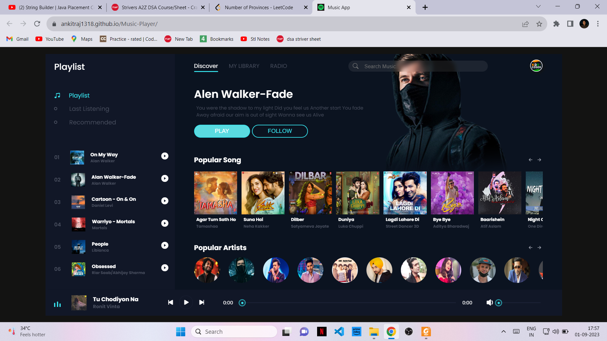
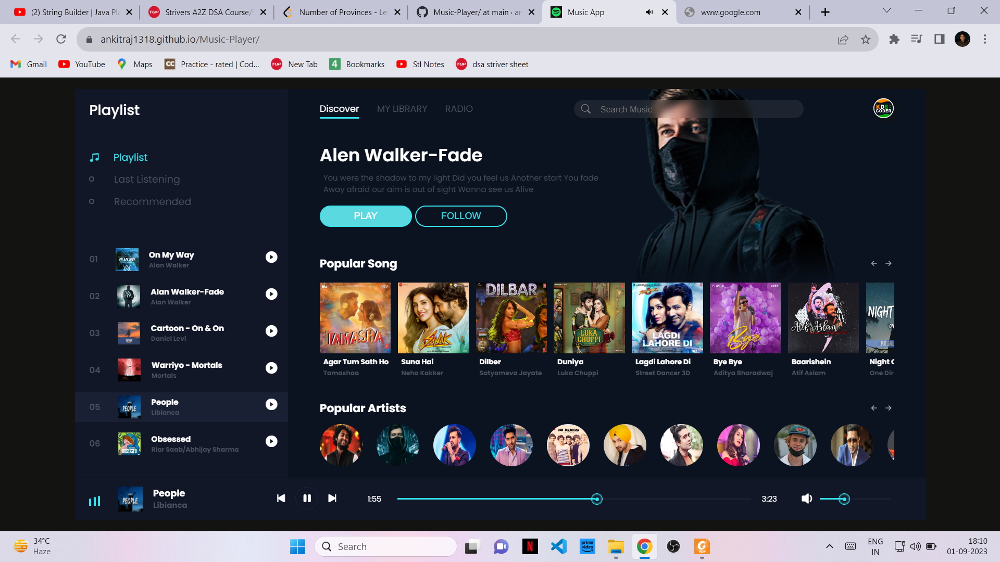

# Music-Player

## Introduction
- Tech Stack - HTML, CSS, JavaScript

- Created a web application with a user-friendly interface for listening to a wide variety of music uploaded to the
  platform.

- Implemented essential features such as a play/pause button, forward/backward music and volume control, allowing
  users to have full control over their listening experience.

## Screenshots

  

### Created By- Ankit Raj
